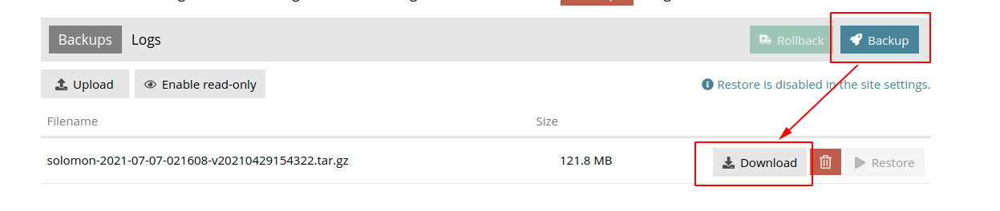
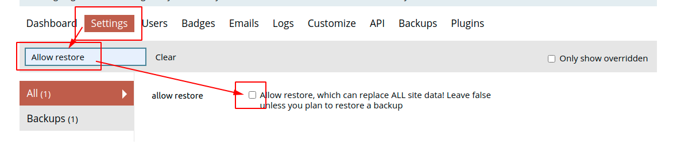
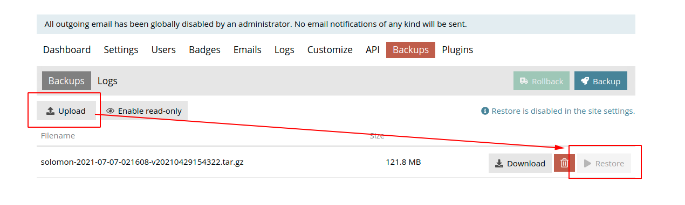

**Already successfully built on local host, but cannot work on docker yet.**

# Discussion Forum via Discourse


---
# Build on local
Start to install the Dependencies:
- Git
- rbenv 
- ruby-build 
- Ruby 
- Rails 
- PostgreSQL 
- SQLite
- Redis 
- Bundler 
- MailCatcher 
- ImageMagick 

```
chmod +x install_discourse.sh
sudo ./install_discourse.sh
```

- Follow from [here](https://meta.discourse.org/t/beginners-guide-to-install-discourse-on-ubuntu-for-development/14727):

```
git clone https://github.com/discourse/discourse.git ~/discourse
sudo -u postgres createuser -s "$USER"
cd ~/discourse

source ~/.bashrc
bundle install

bundle exec rake db:create 
bundle exec rake db:migrate
RAILS_ENV=test bundle exec rake db:create db:migrate

bundle exec rake autospec
```

Start the server:
```
bundle exec rails server
or
bundle exec rails server --binding=0.0.0.0
```

### Create a Admin

```
RAILS_ENV=development bundle exec rake admin:create
```

### Configure Mail

```
mailcatcher --http-ip 0.0.0.0
```

---
#### Error record:

```
root@28b19c1edddf:~/discourse# sudo -u postgres createuser -s "$USER"
could not change directory to "/root/discourse": Permission denied
createuser: error: could not connect to database template1: could not connect to server: No such file or directory
	Is the server running locally and accepting
	connections on Unix domain socket "/var/run/postgresql/.s.PGSQL.5432"?\
```

---
### Install discourse in docker-container

Please follow here: https://github.com/discourse/discourse/blob/master/docs/INSTALL-cloud.md

```
git clone https://github.com/discourse/discourse_docker.git /var/discourse
cd /var/discourse
```

Go to `/samples/` to copy `standalone.yml` to `/containers/app.yml`
Please amend the information about your server.

Next,
```
sudo ./discourse-doctor
```
When you need to amend something, please dont forget to rebuild again.
```
sudo ./launcher rebuild app
```

---
# Move the forum from original server to other server

[Update: 2021/07/08]

Here is recording how to move your original forum to new device.

In your new device, you git clone a new discourse repository and then copy your original app.yml which is in your `containers` folder. 

Use `sudo ./launcher rebuild app` to rebuild it. Or you can install it from scratch. That's ok.

The most important thing is to backup original forum via interface and download it. 



Then go to the newer original forum of new device.

Login your account, and go to setting area to enable the restore function.



Sequentially, go to `Backups` area to upload the backup file which you downloaded from original forum. Then click `Restore`.



After restore, done!!

---
# Reference

- https://discourse.gitea.io/
- [discourse github](https://github.com/discourse/discourse)
- [INSTALL-cloud.md](https://github.com/discourse/discourse/blob/master/docs/INSTALL-cloud.md)
- [discourse_docker github](https://github.com/discourse/discourse_docker)
- [Check the email server](https://www.ndchost.com/wiki/mail/test-smtp-auth-telnet)

---
# Some issues

- [Permission denied during Ubuntu developer setup](https://meta.discourse.org/t/permission-denied-during-ubuntu-developer-setup/121371/3)
