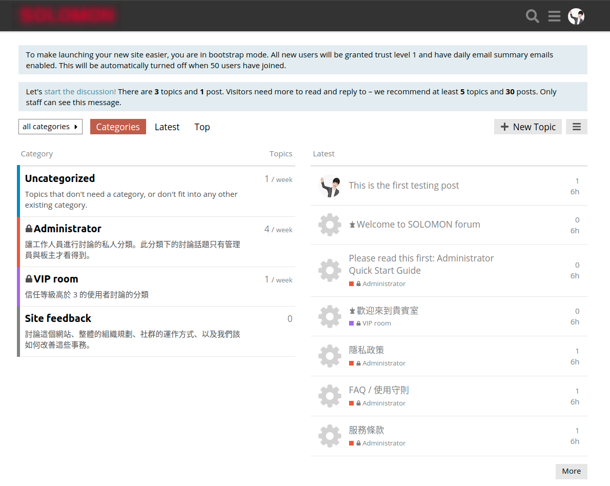

**Already successfully built on local host, but cannot work on docker yet.**

# Discussion Forum via Discourse


---
# Build on local
Start to install the Dependencies:
- Git
- rbenv 
- ruby-build 
- Ruby 
- Rails 
- PostgreSQL 
- SQLite
- Redis 
- Bundler 
- MailCatcher 
- ImageMagick 

```
chmod +x install_discourse.sh
sudo ./install_discourse.sh
```

- Follow from [here](https://meta.discourse.org/t/beginners-guide-to-install-discourse-on-ubuntu-for-development/14727):

```
git clone https://github.com/discourse/discourse.git ~/discourse
sudo -u postgres createuser -s "$USER"
cd ~/discourse

source ~/.bashrc
bundle install

bundle exec rake db:create 
bundle exec rake db:migrate
RAILS_ENV=test bundle exec rake db:create db:migrate

bundle exec rake autospec
```

Start the server:
```
bundle exec rails server
or
bundle exec rails server --binding=0.0.0.0
```

### Create a Admin

```
RAILS_ENV=development bundle exec rake admin:create
```

### Configure Mail

```
mailcatcher --http-ip 0.0.0.0
```

---
#### Error record:

```
root@28b19c1edddf:~/discourse# sudo -u postgres createuser -s "$USER"
could not change directory to "/root/discourse": Permission denied
createuser: error: could not connect to database template1: could not connect to server: No such file or directory
	Is the server running locally and accepting
	connections on Unix domain socket "/var/run/postgresql/.s.PGSQL.5432"?\
```

---
### Skip this part.
```
cd /workspace/discourse_development
git clone https://github.com/discourse/discourse_docker.git discourse
cd discourse
cp samples/standalone.yml containers/childish.yml
```

https://meta.discourse.org/t/permission-denied-during-ubuntu-developer-setup/121371/3

---
# Reference

- https://discourse.gitea.io/
- [discourse github](https://github.com/discourse/discourse)
- [INSTALL-cloud.md](https://github.com/discourse/discourse/blob/master/docs/INSTALL-cloud.md)
- [discourse_docker github](https://github.com/discourse/discourse_docker)